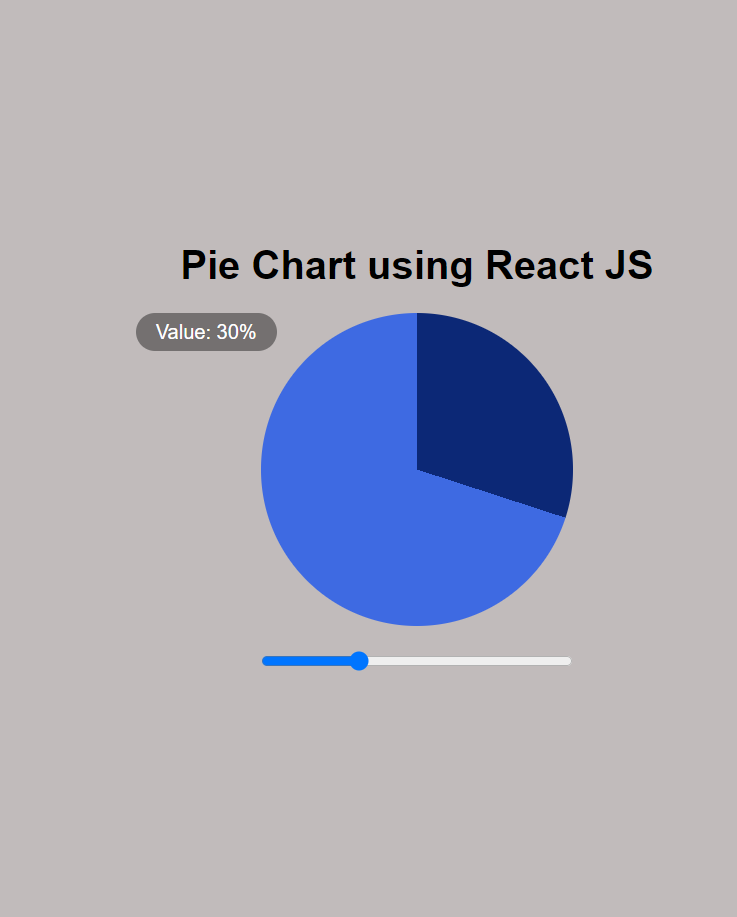

# Interview Task -> Custom Pie Chart

## Task Description

-  Create a custom pie chart with a slider and a legends section using Vanilla JavaScript
-  Changing the slider will update the legend value and the chart colors
-  Send the GitHub repo address for company
-  Eveything must be raw. You can not use any css frameworks and libraries (Bootstrap, MUI, and ...)

## Extra points

-  Create The same result with React will have extra points
-  using hooks in react project will have extra points

## What is covered in this task:

-  Vanilla JavaScript
-  Positions
-  Displays
-  Backgrounds
-  React
-  React hooks
   -  useEffect,
   -  useState
   -  useRef
-  Refactoring
-  GitHub repositories

Hope you enjoy it. Dont forget to give some stars 😊

## Final Result

## resources: 

- "https://developer.mozilla.org/en-US/docs/Web/CSS/gradient/conic-gradient"

- "https://www.w3schools.com/css/css3_gradients_conic.asp"